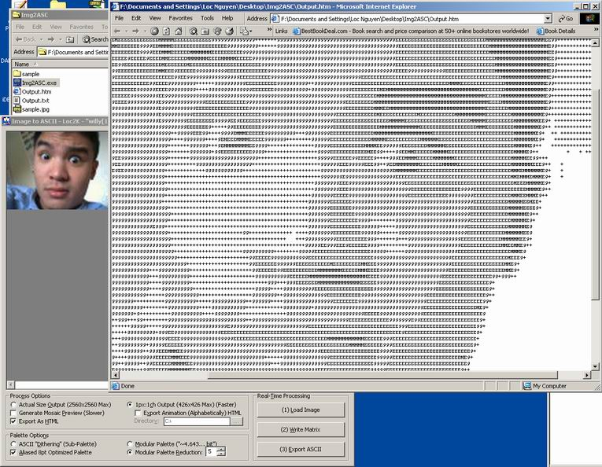



## Img2ASC \(Image to ASCII\) \- Image AND Animation\!

### Description

This program converts an image to ASCII AND image frames to ASCII ANIMATION (in DHTML)! It also has a bunch of palette options unlike other ASCII programs. Vote if you like!
 
### More Info
 

             |
---                |---
**Submitted On**   |2003-08-18 02:08:58
**By**             |[Loc Nguyen](https://github.com/Planet-Source-Code/PSCIndex/blob/master/ByAuthor/loc-nguyen.md)
**Level**          |Intermediate
**User Rating**    |5.0 (50 globes from 10 users)
**Compatibility**  |VB 4\.0 \(32\-bit\), VB 5\.0, VB 6\.0
**Category**       |[Graphics](https://github.com/Planet-Source-Code/PSCIndex/blob/master/ByCategory/graphics__1-46.md)
**World**          |[Visual Basic](https://github.com/Planet-Source-Code/PSCIndex/blob/master/ByWorld/visual-basic.md)
**Archive File**   |[Img2ASC\_\(I1631528182003\.zip](https://github.com/Planet-Source-Code/loc-nguyen-img2asc-image-to-ascii-image-and-animation__1-47792/archive/master.zip)

